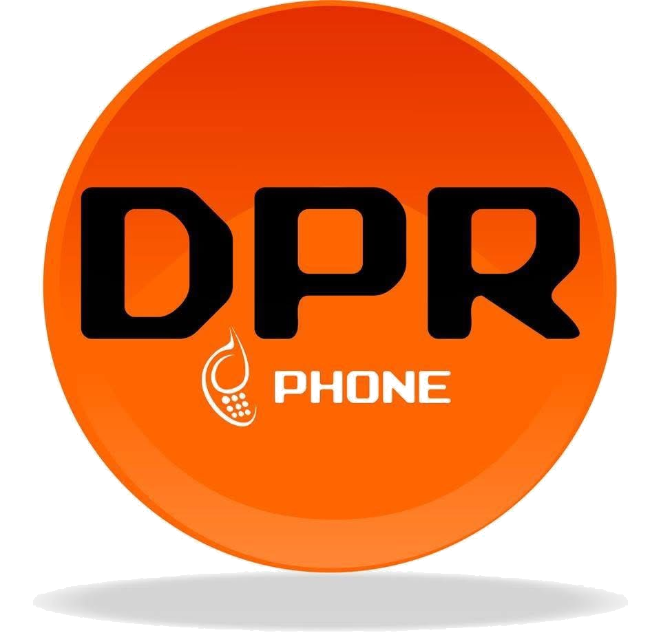

<!DOCTYPE html>
<html lang="es">
<head>
  <meta charset="UTF-8">
  <title>DPR Phone - Recuperación de Datos</title>
  <!-- Font Awesome -->
  <link rel="stylesheet" href="https://cdnjs.cloudflare.com/ajax/libs/font-awesome/6.4.0/css/all.min.css">
  
</head>
<body>

  <!-- Header -->
  <header>
    
    <nav>
      <a href="#inicio">Inicio</a>
      <a href="#servicios">Servicios</a>
      <a href="#otros-servicios">Otros Servicios</a>
      <a href="#about">Acerca de Nosotros</a>
      <a href="#faq">FAQ</a>
      <a href="#contacto" class="contacto"><i class="fab fa-whatsapp"></i> Contacto</a>
    </nav>
  </header>

  <!-- Hero -->
  <section class="hero" id="inicio">
    <h1>DPRPhone</h1>
    
Especialistas en Recuperación de Datos de Teléfonos

    <a href="#otros-servicios" class="cta">Ver Servicios</a>
  </section>

  <!-- Servicios -->
  <section class="servicios" id="servicios">
    
<h2>VIP</h2>
$4,700

Máxima seguridad y velocidad.
<a href="https://wa.me/524612574352?text=Hola,%20quiero%20VIP%20📱" target="_blank" class="btn">Solicitar</a>

    
<h2>Gama Alta</h2>
$3,500

Recuperación avanzada premium.
<a href="https://wa.me/524612574352?text=Hola,%20quiero%20gama%20alta%20📱" target="_blank" class="btn">Solicitar</a>

    
<h2>Gama Media</h2>
$2,200

Confiable para equipos estándar.
<a href="https://wa.me/524612574352?text=Hola,%20quiero%20gama%20media%20📱" target="_blank" class="btn">Solicitar</a>

    
<h2>Gama Baja</h2>
$1,200

Económico para dispositivos básicos.
<a href="https://wa.me/524612574352?text=Hola,%20quiero%20gama%20baja%20📱" target="_blank" class="btn">Solicitar</a>

    

      <h2>Acerca de Nosotros</h2>
      
En <b>DPRPhone</b> somos especialistas en recuperación de datos de teléfonos móviles de todas las gamas.

      

        <a href="https://www.instagram.com/dpr_phone" target="_blank"><i class="fab fa-instagram"></i></a>
        <a href="https://www.tiktok.com/@dprphone" target="_blank"><i class="fab fa-tiktok"></i></a>
      

    

  </section>

  <!-- Otros Servicios -->
  <section class="otros-servicios" id="otros-servicios">
    <h2 style="text-align:center; color:#ff6600; margin-top:50px;">Otros Servicios</h2>
    

      
<h2>Restauración</h2><ul style="text-align:left;"><li>🔧 Pantalla</li><li>🔋 Batería</li><li>🔊 Parlantes</li><li>⚡ Carga</li></ul>

      
<h2>Micro soldadura</h2><ul style="text-align:left;"><li>🔬 Reballing</li><li>🔄 Swap</li><li>🛠️ Otros</li></ul>

      
<h2>Software</h2><ul style="text-align:left;"><li>🤖 Android</li><li>🍏 iOS</li><li>🖥️ Windows</li><li>💻 MacOS</li></ul>

    

  </section>

  <!-- Testimonios -->
  <section class="testimonios">
    <h2>Lo que dicen nuestros clientes</h2>
    

      

"Me recuperaron todas mis fotos, pensé que las había perdido para siempre. ¡Recomendados!"
<strong>- Juan P.</strong>

      

"Excelente servicio, rápido y seguro. Ya es mi centro de confianza."
<strong>- María L.</strong>

    

  </section>

  <!-- FAQ -->
  <section class="faq" id="faq">
    <h2>Preguntas Frecuentes</h2>
    

¿Cuánto tarda la recuperación?

Generalmente entre 24 y 72 horas, dependiendo del daño.

    

¿Qué pasa si no se recuperan los datos?

No se cobra el servicio, aplicamos política de no recuperación = no pago.

    

¿Atienden equipos mojados?

Sí, contamos con tratamiento especial para humedad y líquidos.

  </section>

  <!-- Contacto -->
  <section class="contacto" id="contacto">
    <h2 style="text-align:center; color:#ff6600;">Contáctanos</h2>
    

      
📱 Escríbenos por WhatsApp:

      <a href="https://wa.me/524612574352?text=Hola,%20quiero%20cotizar%20mi%20equipo%20📱💻" target="_blank" class="btn">+52 461 257 4352</a>
    

    

      <iframe 
  src="https://www.google.com/maps/embed?pb=!1m18!1m12!1m3!1d3733.191053973595!2d-100.808838!3d20.528388!2m3!1f0!2f0!3f0!3m2!1i1024!2i768!4f13.1!3m3!1m2!1s0x842cba9ad38b48b5%3A0x2a19fca472f4fc3e!2sNuevo%20Le%C3%B3n%20404%2C%20Alameda%2C%2038050%20Celaya%2C%20Gto.!5e0!3m2!1ses-419!2smx!4v1693600000000" 
  width="100%" height="400" 
  style="border:0;" 
  allowfullscreen="" 
  loading="lazy" 
  referrerpolicy="no-referrer-when-downgrade">
</iframe>
    

  </section>

  <!-- Footer -->
  <footer>
    
📞 Tel: +52 461 257 4352 | ✉️ soporte@dprphone.com

    
&copy; 2025 DPRPhone - Todos los derechos reservados

  </footer>

  <!-- Botones flotantes -->
  <a href="https://wa.me/524612574352?text=Hola,%20quiero%20cotizar%20mi%20equipo%20📱💻" class="whatsapp-float" target="_blank"><i class="fab fa-whatsapp"></i></a>
  <a href="tel:+524612574352" class="call-float"><i class="fas fa-phone"></i></a>

</body>
</html>
